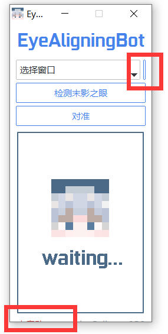
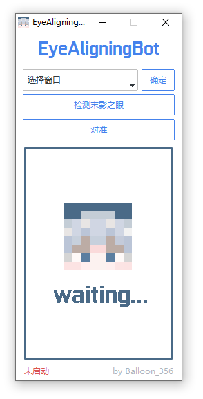
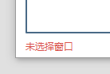
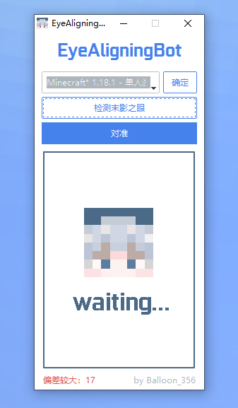
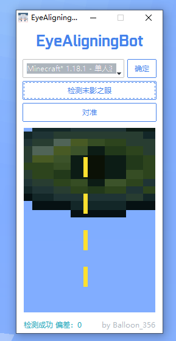
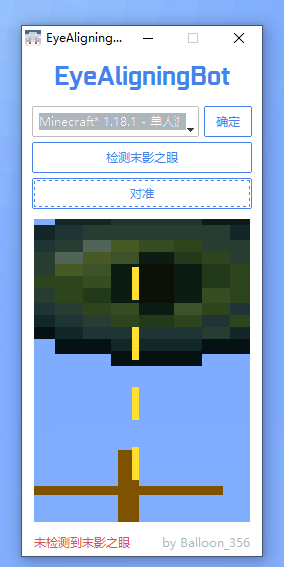

# EyeAligningBot-v1.0

## 最新消息（2022/10/03）

Bot会持续更新，请关注我的b站账号（Balloon_356），使用上有问题请私信（务必先阅读本文）。

代码上的问题或者改进方案可以私信我讨论。

最新下载链接：https://pan.baidu.com/s/190mFSBzqnHXQVMnix5VYXQ （提取码：0356） 

## 简介

我的世界（Minecraft）速通辅助工具，自动完成末影之眼像素级对准。EyeAligningBot（下简称Bot）通过实时截取游戏图像定位末影之眼，并不断调整鼠标十字准星使二者对齐，帮助速通玩家精准定位要塞，完成双传。

A useful tool for Minecraft speedrun.

**适用情况：**

速通中，玩家收集了足够的烈焰棒和末影珍珠，搭建地狱门传送到主世界，接下来需要精确测量要塞的位置。

**默认的设置仅适用于1080p屏幕，其他情况请参考“个性化设置”！！！**

## 快速使用

Bot的用法很简单，打开Bot，接下来只需调整“视频”和“鼠标设置”并按步骤点击Bot界面的选项框和按钮：

1. 基础的对眼操作：投掷末影之眼，等末影之眼稳定在空中，注意十字准星不要压在末影之眼上，暂停游戏并调整视频设置为：FOV 30，调整鼠标设置为：灵敏度 最低，原始输入 关。另外，视频设置界面尺寸设置为：3。
2. 选择窗口：选择Minecraft游戏窗口名，点击右侧“确定”。    ->    Bot状态显示：“窗口句柄：xxx”
3. 检测末影之眼：Bot通过存储的末影之眼模板，在游戏窗口内搜索末影之眼的位置。  ->    Bot状态显示：“检测结果如上”
4. 对准：Bot通过调整鼠标十字准星，自动对准末影之眼瞳孔，并达到像素级精度。    ->    Bot状态显示：“已对准”
5. （下接Ninjabrain-Bot的使用）

另外，b站上有视频教程。如遇到使用问题，请先查看下面的“常见问题”尝试自行解决。

## 相关链接

视频教程：参考我的b站视频（顺便给个三连哦~）

我的b站账号：https://space.bilibili.com/244384103/

我的github账号：https://github.com/Balloon-356

Bot开源代码：https://github.com/Balloon-356/EyeAligningBot

## 个性化设置

在默认设置的基础上，为了能兼容不同玩家的设备并适应玩家颜色偏好，添加了个性化设置的功能。

个性化设置主要涉及两方面：不同分辨率屏幕的模板（在./imgs中）、Bot界面主题修改（setting.json）。前者实现了不同设备的兼容，后者允许玩家自定义Bot界面的颜色风格。
解压Bot的压缩包，关注两个文件（夹），./imgs 和 setting.json。

1. ./imgs，该文件夹下存放了各种分辨率的图片，请依据自己的显示屏分辨率选择（默认1080x1920），修改settings.json的内容。
2. settings.json，该文件是Bot的配置文件。文件内容以及参数说明如下，请依据自己的需求进行修改。

```
// 按照显示屏分辨率设置，目前支持3种分辨率，"1080": 1080x1920，"2k": 1440x2560，"4k": 2160x3840
// 如果不在上述3种分辨率中，请选择最相近的分辨率，如果bot无法正常使用，请在b站私信
// 例如：屏幕是1080x1920，则修改为"resolution": "1080",
// 如有其他常见的分辨率，可在b站私信增加
"resolution": "2k",

// 下面的参数是用于筛选窗口名的。简单来说，只要把游戏窗口的部分文字填到下面的 :"xxx"  中即可。
// (有代码基础的玩家可以这样理解，预先设置一个字符串，去检索全部窗口名的列表，如果窗口名包含这个字符串，就保留该窗口名)
"minecraft_windows_filter": "Minecraft" ,

// 设置Bot主题！可选的主题附在下面，可以设置自己喜欢的颜色。
"bot_theme": "litera"
```

```
// 可选的颜色主题：
// theme: "cosmo", "flatly", "litera", "minty", "yeti", "pulse", "united",
//              "morph",  "journal",  "darkly",  "superhero", "solar", "cyborg",
//              "vapor", "simplex",  "cerculean",
```

### 分辨率设置

请先阅读上面的文字（“个性化设置”），依据屏幕分辨率设置settings.json的内容。

修改settings.json文件中"resolution"一行，目前支持3种分辨率：1080x1920，填"1080"；1440x2560，填"2k"；2160x3840，填"4k"。（注意不要把逗号删了）

**例如：**

屏幕分辨率为1080x1920，则修改为：

```
"resolution": "1080",
```

### 颜色主题设置

只是一个附加功能，在此不多做描述，修改不了就算了。

请先阅读上面的文字（“个性化设置”），依据屏幕分辨率设置settings.json的内容。

**例如：**

```
"bot_theme": "superhero"
```


## 常见问题

首先，如果没有看过我的b站视频，还请先看一看，视频里讲得很清楚，一步一步来一般不会出错。

如果问题没有在此列出（请先确认自己操作无误），请在b站私信我，帮助改进，谢谢！

### 1. Bot显示不全

**问题示例：**

“确定”按钮显示不出来，最下面的字显示不全。



**解决办法：**

1. 桌面右键，选择“显示设置”
2. “缩放与布局”，“更改文本、应用等项目的大小”，调为“100%”
3. 正常显示情况如下：



### 2. “未选择窗口”

**问题示例：**

点击“检测末影之眼”，左下角提示“未选择窗口”。



**解决办法：**

1. 首先确认Bot显示正常，请参考“常见问题1-Bot显示不全”。
2. 使用Bot需要先“选择窗口”，然后点“确定”，请确保这两步都完成。


### 3. “检测末影之眼”显示“偏差较大：xx”

**问题示例：**

点击“检测末影之眼”，左下角提示：“偏差较大：xx”



**解决办法：**

1. 首先确认选择的窗口是当前游戏窗口，并完成了基本的对眼操作后暂停了游戏。
2. 如果“偏差较大：xx”中，xx数字大于10，则有多种可能的错误。一，游戏窗口未最大化或全屏；二，末影之眼不在屏幕中心或被遮挡（这种情况下，偏差比较小），请重新调整末影之眼位置；三，分辨率设置错误，请仔细阅读“个性化设置”。

正常情况如下图：




### 4. 点击“对准”，游戏中视线瞬间朝向脚底

**解决办法：**

请将鼠标设置中的“原始输入”设置为“关”，“灵敏度”设置为“哈欠”（即调到最低）。

### 5. 对准时，提示“未检测到末影之眼”

**问题示例：**

按步骤玩成了选择窗口，末影之眼检测成功，但“对准”时提示“未检测到末影之眼”



**解决办法：**

有几种可能：1. 末影之眼被遮挡，不要挡住就好；2. 末影之眼已经处于掉落状态， 再仍一次；3. 偏差过大，请再次尝试。


### 6. 十字准星来回移动（或不动），无法对准

“来回移动”可能是鼠标灵敏度太高。如果十字准星不动，请在b站私信我，上面有链接。
